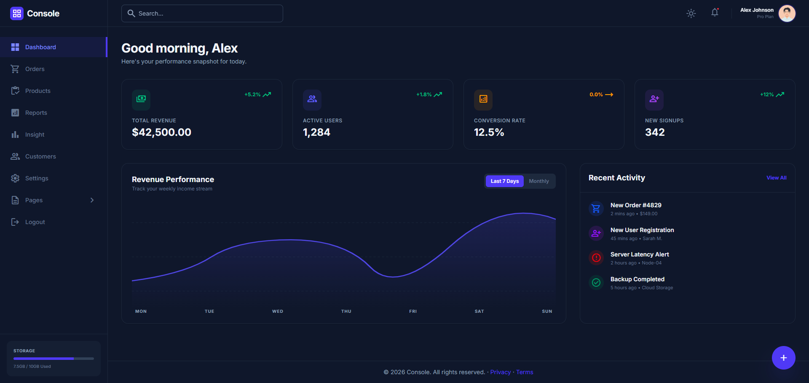

# Dashwind

Template admin modern dan responsif, dibangun dengan HTML5 dan Tailwind CSS.




## Fitur

- 📱 **Responsif**: Tampilan adaptif dari mobile sampai desktop.
- 🌙 **Dark Mode**: Dukungan tema gelap bawaan.
- ⚡ **Tailwind CSS**: Menggunakan utility-first CSS (via CDN untuk kemudahan).
- 🎨 **Desain Modern**: Menggunakan font Inter dan Material Symbols.
- 📊 **Visualisasi**: Kartu metrik dan grafik sederhana menggunakan CSS/SVG.

## Cara Instalasi & Penggunaan

Dashwind didesain agar mudah dipakai tanpa langkah build, tapi ada juga cara untuk menjalankan lokal dengan server statis atau membangun ulang stylesheet Tailwind jika ingin kustom.

Pilihan cepat (tanpa instalasi):

1. Salin atau unduh repository.
2. Buka file `index.html` secara langsung di browser (double-click).

Catatan: beberapa fitur (mis. pemanggilan asset via fetch atau path relatif) bekerja lebih andal ketika dijalankan lewat server lokal.

Menjalankan dengan server lokal (direkomendasikan):

- Menggunakan Live Server (VS Code extension): instal ekstensi "Live Server" lalu klik "Go Live".
- Menggunakan Python (tersedia di Windows jika Python terpasang):

```powershell
cd path\ke\dashwind
python -m http.server 8000
# buka http://localhost:8000 di browser
```

- Menggunakan Node (tanpa instal global):

```powershell
cd path\ke\dashwind
npx http-server -p 8080
# buka http://localhost:8080 di browser
```

Opsi pembangunan Tailwind (opsional — untuk kustomisasi CSS):

Jika Anda ingin mengedit `assets/input.css` dan membangun ulang `assets/styles.css` menggunakan Tailwind CLI:

```powershell
cd path\ke\dashwind
npm init -y
npm install -D tailwindcss postcss autoprefixer
npx tailwindcss -i ./assets/input.css -o ./assets/styles.css --watch
```

File yang perlu diketahui:

- `index.html` — halaman dashboard utama.
- `assets/input.css` — file sumber Tailwind (jika Anda melakukan build sendiri).
- `assets/styles.css` — stylesheet yang dibundel dan dipakai di halaman.
- `tailwind.config.js` — konfigurasi Tailwind (sudah ada di repo).

Contoh penggunaan singkat:

- Buka [index.html](index.html) untuk melihat dashboard.
- Halaman lain seperti `product.html`, `order-management.html`, dan `setting.html` tersedia sebagai contoh layout.

## Teknologi

- HTML5
- Tailwind CSS (versi CDN atau CLI untuk build)
- Google Fonts (Inter)

## Lisensi

Proyek ini berlisensi MIT — lihat file `LICENSE` untuk detail.

## Penulis

**M. Gema Maulana** — Web Developer
